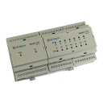

ioBroker MegaD-2561 adapter (Version by Filippovsky, based on adapter of ausHaus and BlueFox)
=================

### Current version: 0.15.92 ( 21.11.2017 22:42 MSK )
### Текущая версия:  0.15.92 ( 21.11.2017 22:42 MSK )

### ВНИМАНИЕ!! Этот драйвер еще не закончен. Для реальной работы его использовать пока нельзя. Можно использовать для целей общего ознакомления.

### ATTENTION! THIS DRIVER IS UNDER DEVELOPMENT NOW!! IT CAN NOT BE USED FOR REAL WORK!! USE IT JUST FOR INFORMATION!

[](https://www.npmjs.com/package/iobroker.megadjt)
[](https://www.npmjs.com/package/iobroker.megadjt)

[](https://nodei.co/npm/iobroker.megadjt/)


Lets control the [MegaD-2561](http://www.ab-log.ru/smart-house/ethernet/megad-2561) over ethernet.
## English 
[по русски](#Русский)

## Install

```node iobroker.js add megadjt```

### Information
The device has 36 ports, inputs/outputs and DHT11/DHT22, I2C bus, DS18B20 in ports and 1WBUS.
To read the state of the port call
```http://mega_ip/sec/?pt=4&cmd=get``` , where sec is password (max 3 chars), 4 is port number
The result will come as "ON", "OFF" or analog value for analog ports

To set the state call:
```http://megad_ip/sec/?cmd=2:1``` , where sec is password (max 3 chars), 2 is port number, and 1 is the value
For digital ports only 0, 1 and 2 (toggle) are allowed, for analog ports the values from 0 to 255 are allowed

The device can report the changes of ports to some web server in form
```http://ioBroker:80/?pt=6```  , where 6 is the port number

### Configuration

- IP: IP address of MegaD-2561;
- MegaD-2561 Name: Name of the MegaD-2561 to assign the port changes, e.g. "DevA". If no name set the adapter instance will be used for that;
- Port: Listening port on ioBroker. Default value: 80. 
- Poll interval: poll interval in seconds. All configured input ports will be polled in defined interval;
- Password: password to access the device (max 3 characters). Default value "sec";

MegaD-2561 can report about changes on some ports if configured. 
You can configure something like that "http://ioBrokerIP/instance" on MegaD-2561 in "Net"-Field and MegaD-2561 will send reports like this one "http://ioBrokerIP/instance/?pt=7" to ioBroker. 
That means the button on port 7 was pressed. ioBroker expects instance number (e.g. "0") or defined name of MegaD-2561 (e.g. "DevA"). The "Net" field will look like: "http://192.168.0.8/0/".

### Ports
All ports, that are desired to be used must be configured in right order. Following settings must be set for every port:

- Name: name of the port. Used by ioBroker;
- Input: Is the port INPUT(true) or output(false);
- Switch: Is the port can be ON or OFF (in this case value = TRUE) or just used to send the reports about button press (FALSE);
- Digital: Analog or digital port. ioBroker expects analog ports with range from 0 to 255.
- Offset: offset for the **analog** port.
- Factor:  multiply factor for **anaolog** port.
- Long press: detect long press on digital port (port have to be SWITCH type)
- Double click ms: interval for detection of double click

For input:
```
ioBrokerValue = MegaValue * factor + offset;
```

For output: 
```
MegaValue = (ioBrokerValue - offset) / factor;
```

To get the range of the analog value from 100 to 500 set the factor as 400 and offset = 100.

**The order of the ports is very important. The port in first row will be associated with P0 in MegaD-2561. In row number 14 with P13.**

-------------------
## Русский        
Подробную документацию можно найти здесь: [http://www.ab-log.ru/smart-house/ethernet/MegaD-2561](http://www.ab-log.ru/smart-house/ethernet/MegaD-2561)
    
### Настройки

- IP Адрес устройства: IP адрес MegaD-2561;
- MegaD Имя: Имя MegaD-2561 устройства для идентификации сообщений о смене состояния порта от MegaD-2561, например "DevA". Если имя не задано, то для этих целей будет использоватся номер инстанции драйвера.;
- ioBroker веб-порт: Порт на котором ioBroker разворачивает веб сервер для приёма сообщений от MegaD-2561. Значение по умолчанию: 80. 
- Интервал опроса (сек): инетрвал опроса портов в секундах;
- MegaD-2561 Пароль: пароль для доступа на MegaD-2561 (максимально 3 символа). Значение по умолчанию: "sec";
- Интервал для длинного нажатия (мс): если отжатие после нажатия кнопки произошло позже указанного интервала, то сгенерируется длинное нажатие;
- Интервал двойного нажатия (мс): если между нажатиями пройдет меньше указанного времени, то сгенерируется двойное нажатие;

В сетевых настройках MegaD-2561 можно сконфигуририровать IP-адрес ioBroker. При каждом нажатии на кнопку MegaD-2561 сообщает ioBroker (restAPI) номер сработавшего входа. 

Выглядит запрос примерно следующим образом:
´´´http://192.168.0.250/0/?pt=7´´´

### Порты
Необходимо сконфигурировать все порты, которые должны быть видимы в ioBorker. Для каждого порта необходимо настроить следующее:

- Имя: имя порта. Исползуется в ioBroker для создание объектов;
- Вход: является ли порт входом (true) или выходом(false);
- Переключатель: Может ли порт быть в положениях ВКЛ и ВЫКЛ (в этом случае значение TRUE) или он просто используется для сигнализирования нажатия на кнопку (FALSE);
- Цифровой: Цифровой или аналоговый порт. ioBroker ожидает значени с аналогового порта в промежутке от 0 до 255.
- Множитель:  множитель для значения **аналогового** порта.
- Сдвиг: сдвиг для значения **аналогового** порта.
- Длинное нажатие: если активировано, то порт будет генерировать событие "длинное нажатие" в объекте port_long (Порт должен быть цифровым и иметь тип "Переключатель")
- Двойное нажатие: если активировано, то порт будет генерировать событие "double click" в объекте port_double

Для выхода:

```
MegaЗначение = (ioBrokerЗначение - Сдвиг) / Множитель;
```

Для входа:

```
ioBrokerЗначение = MegaЗначение * Множитель + Сдвиг;
```

Например, чтобы получить интервал значений от 100 до 500 нужно установить сдиг 100 и множитель 400.

Только аналоговые порты принимают во внимание Множитель и Сдвиг.

**Порядок портов очень важен. Порт в первой колонке таблицы ассоциируется с портом P0 на MegaD-2561. Порт в колонке 14 с P13.**          

### Отправка SMS
Сохраните текст SMS в переменную megadjt.0.sms.text с признаком ack:false
Драйвер автоматически отправит SMS, результат отправки будет помещен в лог.
Перед использованием этого функционала в настройках драйвера должны быть заполнены SMS API KEY и номера телефонов, на которые надо 
отправить SMS.
Номера вводятся в формате 79031234567 через запятую.
Для отправки SMS в настройках драйвера надо включить галочку "Включить отправку SMS".
          
## Changelog
### 0.14.0 (2017-11-12)
* (filippovsky) добавлена поддержка отправки SMS-сообщений

### 0.12.0 (2017-10-14)
* (filippovsky) добавлены новые прошивки

### 0.8.0 (2017-09-07)
* (filippovsky) добавлены 8I7O-S и 8I7O-SD

### 0.7.19 (2017-08-27)
* (filippovsky) добавлена версия прошивки v4.16b3

### 0.7.18 (2017-08-17)
* (filippovsky) добавлены версии прошивок v4.15b2 - 4.15b9

### 0.5.2 (2017-03-28)
* (filippovsky) добавлены версии прошивок v4.13b6 и v4.13b7

### 0.5.0 (2017-03-27)
* (filippovsky) fw_version и fw_version_last_known перенесены из канала version

### 0.4.2 (2017-03-23)
* (filippovsky) Добавлена возможность аварийной перепрошивки Меги (режим bootloader)

### 0.4.1 (2017-03-23)
* (filippovsky) При прошивке версии можно выбрать прошиваемую версию. К версиям добавлены дата выхода и краткое описание

### 0.3.35 (2017-03-19)
* (filippovsky) При выборе модели исполнительного модуля - показываем картинку

### 0.3.15 (2017-03-19)
* (filippovsky) После сохранения настроек Меги в файл - он копируется в папку ioBroker/etc/iobroker.megadjt,
чтобы не потерять его при обновлении версии драйвера

### 0.3.10 (2017-03-19)
* (filippovsky) Возможность сохранения настроек Меги в файл

### 0.3.0 (2017-03-18)
* (filippovsky) Возможность перепрошивки Меги

### 0.2.30 (2017-03-14)
* (filippovsky) В настройках драйвера добавлено отображение текущей версии прошивки устройства

### 0.2.0 (2017-03-08)
* (filippovsky) Добавлены новые свойства: version.firmware_last_known

### 0.1.49 (2017-03-08)
* (filippovsky) Добавлены новые свойства: version.controller_model

### 0.1.48 (2017-03-08)
* (filippovsky) Добавлены новые свойства: version.firmware и version.is_firmware_actual

### 0.1.35 (2017-02-26)
* (filippovsky) Добавлена поддержка датчиков температуры DS18B20 на 1-wire шине

### 0.1.34 (2017-02-26)
* (filippovsky) исправлена ошибка оригинального драйвера Megadd.
Ошибка проявлялась в неправильном алгоритме опроса портов, сконфигурировааных как 1WBUS,
что приводило к утечкам памяти и перенагрузке сетевого интерфейса

### 0.1.8 (2017-02-18) - 0.1.33 (2017-02-25)
* (filippovsky) добавлена функция getFirmwareVersion( )
Запрашивает у Меги версию прошивки и заносит ее в базу.
Может быть использовано для определения набора поддерживаемых прошивкой функций 
и для определения необходимости обновления прошивки.

### 0.1.4 (2017-02-17)
* (filippovsky) initial commit

### 0.1.3 (2017-01-07)
* (ausHaus) add I2C Bus (HTU21D, BH1750, TSL2591)

### 0.1.2 (2016-11-23)
* (ausHaus) add DS2413 out A/B

### 0.1.0 (2016-11-01)
* (ausHaus) initial commit

